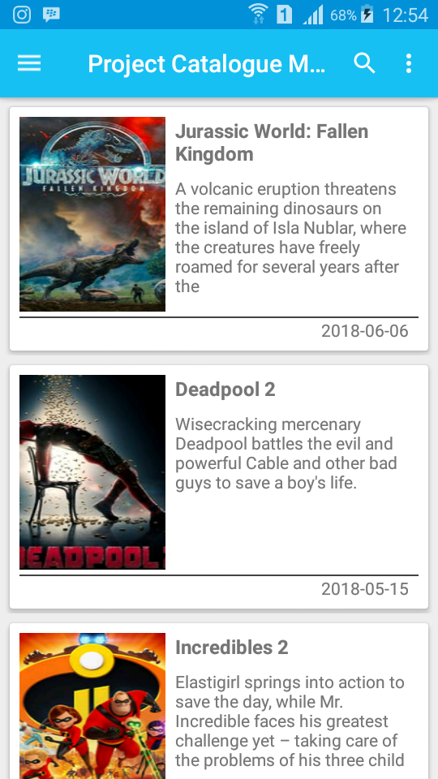
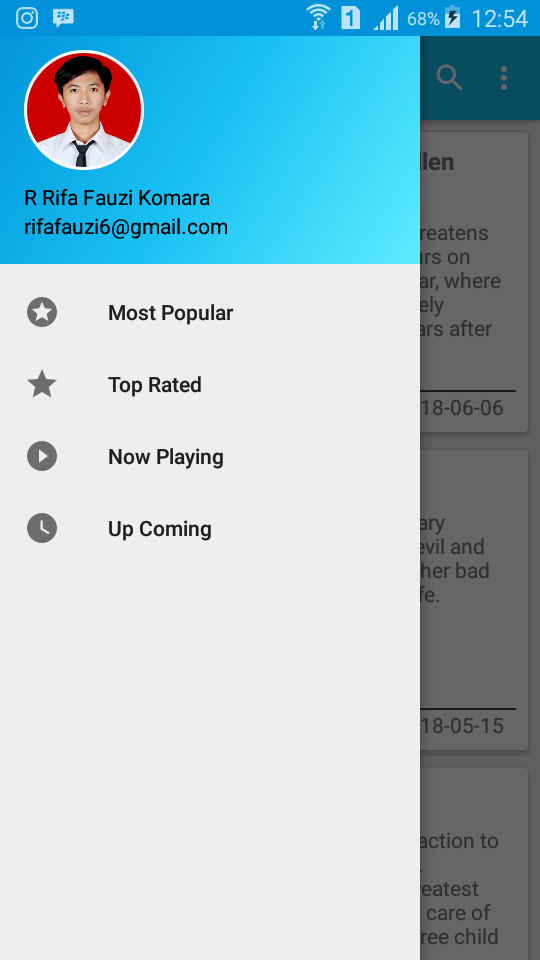
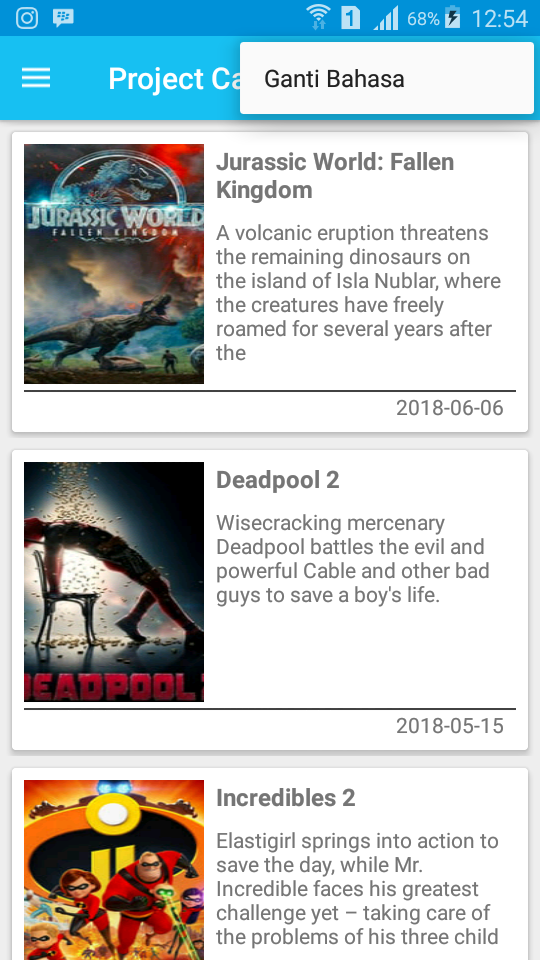
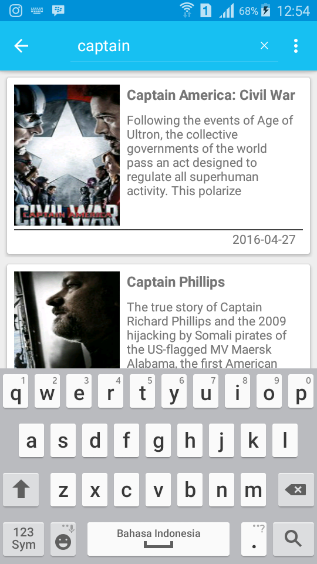
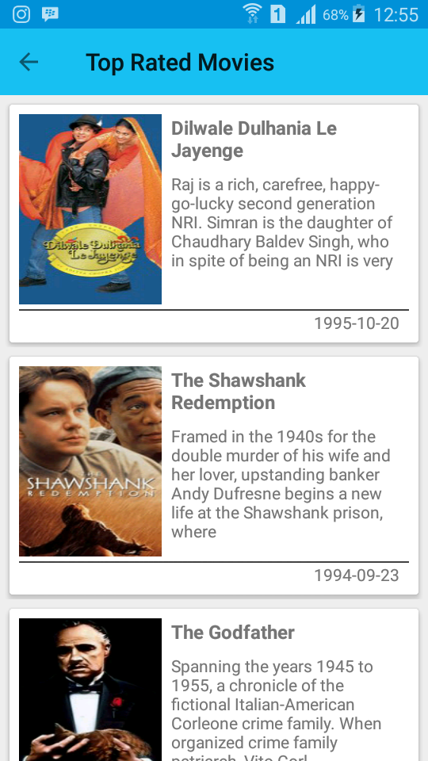
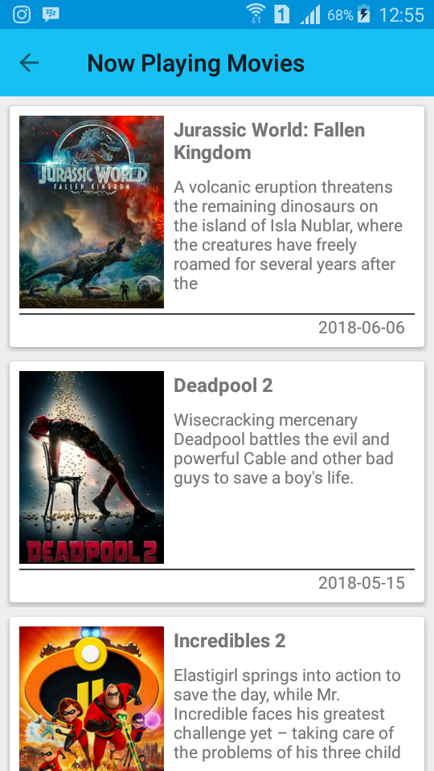
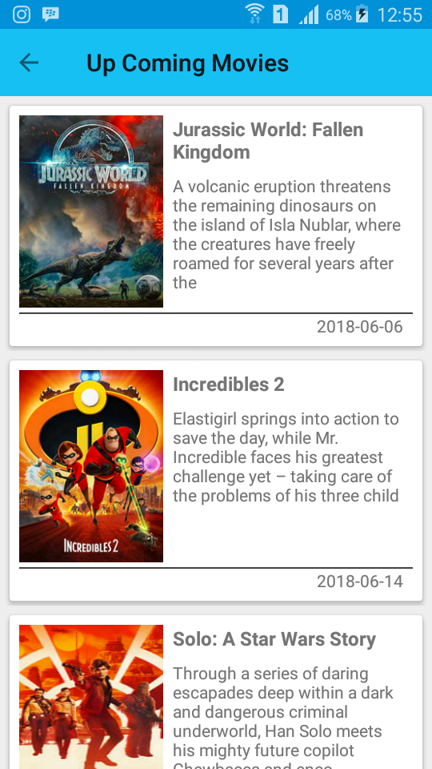
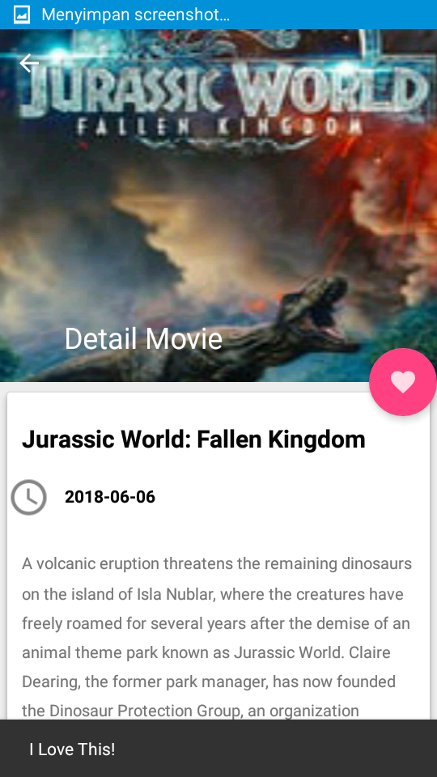

# ProjectCatalogueMovieUIUX
Aplikasi katalog movie untuk submission kedua beasiswa MADE (Menjadi Android Developer Expert) dari Dicoding https://www.dicoding.com/academies/14/ . Thanks to Google yang telah memberikan beasiswa
untuk dapat mengikuti kelas ini.

## Screenshots

<pre>
                                             
</pre>

<pre>
                                    
</pre>

### Persyaratan aplikasi

* [x] Terdapat fitur untuk mencari film
* [x] Halaman detail untuk menampilkan detail fim yang telah dipilih pada halaman list film.
* [x] Tampilan poster dari film.
* [x] Navigasi untuk halaman upcoming, now playing, dan search.
* [x] Menggunakan recyclerview untuk menampilkan data bisa berupa list, atau card.
* [x] Halaman setting untuk mengganti bahasa atau localization. Aplikasi harus mendukung bahasa Indonesia dan bahasa Inggris.
* [x] Semua fungsi dari fitur project sebelumnya (Submission Project Catalogue Movie) harus tetap berjalan.

### Petunjuk menjalankan source code aplikasi

Untuk menjalankan source code aplikasi ini, anda perlu registrasi API KEY dari www.themoviedb.org
kemudian memasukkan API KEY yang telah didapat ke dalam file ***utils/UtilsConstant.java***

```
public final static String API_KEY = "Paste API KEY anda disini";
```

Kemudian hapus baris berikut pada file ***build.gradle***

```
buildConfigField 'String', "ApiKey", Catalogue_Movie_ApiKey
```

## Author

* **R Rifa Fauzi Komara**

Jangan lupa untuk follow dan ★
